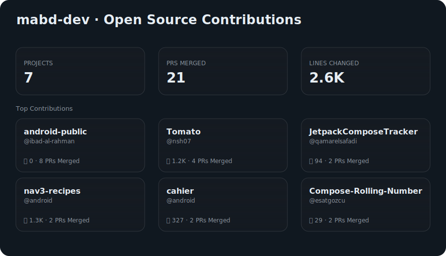

<h1 align="center">Hi, I'm Mahmoud 👋</h1>

  Software Developer specializing in mobile and backend development with a focus on
  building scalable, maintainable applications.

<h2>🚀 What I'm Working On</h2>
<ul>
  <li>
    🔭
    <a href="https://github.com/mabd-dev/gh-oss-stats">Github OSS Stats</a>
    &
    <a href="https://github.com/mabd-dev/gh-oss-stats-action">Github OSS Stats Action</a>
  </li>
  <li>👨‍💻 Portfolio: <a href="https://mabd.dev">mabd.dev</a></li>
  <li>📝 Writing on <a href="https://medium.com/@mabd.dev">Medium</a></li>
</ul>

<h2>⭐ Featured Project — Habitsss</h2>

<table>
  <tr>
    <td width="260" align="center">
      
        
      
    </td>
    <td valign="top">
      <h3>Habitsss — Android Habit Tracker</h3>
      

      A production-grade habit tracking application focused on streaks, analytics,
      and long-term consistency.
      

      

      📱 <strong>350+ real users on Google Play</strong> 
      🏗️ Built with multi-module clean architecture 
      📊 Advanced analytics & widget support 
      ⚡ Jetpack Compose + Kotlin
      

      

      🔗 <a href="https://github.com/mabd-dev/habitsss"><strong>View Releases</strong></a> 
      📥 <a href="https://github.com/mabd-dev/habitsss/releases/latest"><strong>Download APK</strong></a>
      

    </td>
  </tr>
</table>

<h2>📝 Latest Articles</h2>

  I write about <strong>software engineering, Go, AI tooling, and developer productivity</strong>.
   
  👉 <a href="https://medium.com/@mabd.dev"><strong>medium.com/@mabd.dev</strong></a>

<table>
  <tr>
    <td width="100%" valign="top">
      <h3>Building a Vim-Powered Jira Client with Compose Multiplatform & Claude</h3>
      

        Jira is powerful — but painfully slow for keyboard-driven workflows.
        As a daily Vim user, I kept reaching for speed that simply wasn’t there… so I built my own keyboard-first Jira client using Compose Multiplatform and a custom Vim engine.
      

      

        🔗 <a href="https://medium.com/@mabd.dev/building-a-vim-powered-jira-client-with-compose-multiplatform-claude-21bbf29477df">Read article</a> 
        📅 Feb 23, 2026 · ⏱ 13 min read 
        🏷️ Vim · Compose Multiplatform · Productivity
      

    </td>
  </tr>
  <tr>
    <td width="100%" valign="top">
      <h3>🧠 Git Worktrees: The Secret Weapon for Running Multiple AI Coding Agents in Parallel</h3>
      

        Stop your AI agents from stepping on each other. Git worktrees enable true
        parallel development with Claude Code, Codex, and other AI tools.
      

      

        🔗 <a href="https://medium.com/@mabd.dev/git-worktrees-the-secret-weapon-for-running-multiple-ai-coding-agents-in-parallel-e9046451eb96">Read article</a> 
        📅 Dec 9, 2025 · ⏱ 5 min read 
        🏷️ AI · AI Agents · git-worktrees · vibe-coding
      

    </td>
  </tr>

  <tr>
    <td width="100%" valign="top">
      <h3>🔧 I Built a Tool to Track My Open Source Contributions</h3>
      

        GitHub’s contribution graph shows activity—but not impact. I built a tool to
        track which open-source projects I actually contributed to.
      

      

        🔗 <a href="https://medium.com/@mabd.dev/i-built-a-tool-to-track-my-open-source-contributions-b2af92c955e7">Read article</a> 
        🔧 Repositories:
        <a href="https://github.com/mabd-dev/gh-oss-stats">gh-oss-stats</a>,
        <a href="https://github.com/mabd-dev/gh-oss-stats-action">gh-oss-stats-action</a> 
        📅 Dec 22, 2025 · ⏱ 4 min read 
        🏷️ Go · Custom GitHub Actions · Mobile Development
      

    </td>
  </tr>

  <tr>
    <td width="100%" valign="top">
      <h3>🔍 Search Engine from Scratch — Part 1: The Inverted Index</h3>
      

        From naive string matching to information retrieval. Building a text-based
        search engine in Go, one concept at a time.
      

      

        🔗 <a href="https://medium.com/@mabd.dev/building-a-search-engine-from-scratch-the-inverted-index-019c599b3c59">Read article</a> 
        🔧 Repository:
        <a href="https://github.com/mabd-dev/search-engine">search-engine</a> 
        📅 Nov 20, 2024 · ⏱ 3 min read 
        🏷️ Search Engine · Go
      

    </td>
  </tr>
</table>

<h2>📊 OSS Contributions</h2>

  
   
  <a href="https://mabd.dev/#contributions-list">View detailed list →</a>
   
  Built with <a href="https://github.com/mabd-dev/gh-oss-stats">gs-oss-stats</a>

<!-- <h2>📈 GitHub Stats</h2>

  

  

 -->

<!-- 
 -->

<h2>🛠 Tech Stack</h2>

  <strong>Mobile:</strong> Android, Kotlin, Jetpack Compose, Firebase 
  <strong>Backend:</strong> Go, Java, Django 
  <strong>Frontend:</strong> Vue.js 
  <strong>Tools:</strong> Linux, Figma

<h2>🤝 Connect</h2>

  <a href="https://linkedin.com/in/mahmoud-abdallah-66200915b">LinkedIn</a> ·
  <a href="https://medium.com/@mabd.dev">Medium</a> ·
  <a href="https://www.leetcode.com/mabd-dev">LeetCode</a>

  <em>
    Open to collaboration on interesting projects.
    Let’s talk software architecture, mobile development, or backend systems.
  </em>

