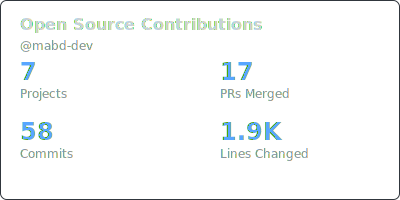

<h1 align="center">Hi 👋, I'm Mahmoud</h1>
<h3 align="center">Software Developer specializing in mobile and backend development with a focus on building scalable, maintainable applications.</h3>

<!-- 
  
 -->

- 🔭 I’m currently working on [Github OSS Stats](https://github.com/mabd-dev/gh-oss-stats) & [Github OSS Stats Action](https://github.com/mabd-dev/gh-oss-stats-action) 

- 👨‍💻 All of my projects are available at [https://mabd.dev](https://mabd.dev)

- 📝 I regularly write articles on [https://medium.com/@mabd.dev](https://medium.com/@mabd.dev)

- 💬 Ask me about **android, kotlin**

see [Detailed List](https://mabd.dev/#contributions-list)

 

 

<h3 align="left">Connect with me:</h3>

<h3 align="left">Languages and Tools:</h3>

           

<!-- 

 -->

### Let's Connect

Open to collaboration on interesting projects and discussing software architecture, mobile development, or backend systems.

<!-- Little about me: -->

<!-- - 🔭 I’m currently working on [Empty Android App](https://play.google.com/store/apps/details?id=com.mabd.empty)
- 🌱 I’m currently learning Jetpack Compose
- 🤔 I’m looking for help with [DFont library](https://github.com/mahmoud-abdallah863/DFont)
- 💬 Ask me about anything
- 📫 How to reach me: gmail: mabdallah863@gmail.com -->

<!-- Nice to see you here!  -->
<!--  -->

<!--
 

### 🛠 Languages and Tools
#### Programming Languages
    

#### Operating Systems
  

 

 

-->

<!-- this is **open source development** 🐧! -->

<!--
**mahmoud-abdallah863/mahmoud-abdallah863** is a ✨ _special_ ✨ repository because its `README.md` (this file) appears on your GitHub profile.

Here are some ideas to get you started:

- 🔭 I’m currently working on ...
- 🌱 I’m currently learning ...
- 👯 I’m looking to collaborate on ...
- 🤔 I’m looking for help with ...
- 💬 Ask me about ...
- 📫 How to reach me: ...
- 😄 Pronouns: ...
- ⚡ Fun fact: ...
-->
 
