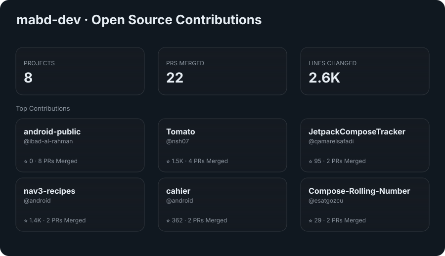

<h1 align="center">Hi, I'm Mahmoud 👋</h1>

  Software Developer specializing in mobile and backend development with a focus on
  building scalable, maintainable applications.

<!-- 

<h2>🚀 What I'm Working On</h2>
<ul>
  <li>
    🔭
    <a href="https://github.com/mabd-dev/gh-oss-stats">Github OSS Stats</a>
    &
    <a href="https://github.com/mabd-dev/gh-oss-stats-action">Github OSS Stats Action</a>
  </li>
  <li>👨‍💻 Portfolio: <a href="https://mabd.dev">mabd.dev</a></li>
  <li>📝 Writing on <a href="https://medium.com/@mabd.dev">Medium</a></li>
</ul> -->

<h2>⭐ Featured Projects</h2>

<table>
  <tr>
    <td width="50%" align="center">
      
    </td>
    <td width="50%" align="center">
      
    </td>
  </tr>
</table>

## 📝 Latest Articles

I write about **software engineering, Go, AI tooling, and developer productivity**.

- [Adding Image Uploads to a Go Backend: Validation, Resizing, Cloudflare R2, and Orphan Cleanup](https://medium.com/@mabd.dev/adding-image-uploads-to-a-go-backend-validation-resizing-cloudflare-r2-and-orphan-cleanup-cae79a105b5e)
- [Building a Vim-Powered Jira Client with Compose Multiplatform & Claude](https://medium.com/@mabd.dev/building-a-vim-powered-jira-client-with-compose-multiplatform-claude-21bbf29477df)
- [I Built a Tool to Track My Open Source Contributions](https://medium.com/@mabd.dev/i-built-a-tool-to-track-my-open-source-contributions-b2af92c955e7)
- [Building a Search Engine from Scratch: The Inverted Index](https://medium.com/@mabd.dev/building-a-search-engine-from-scratch-the-inverted-index-019c599b3c59)
- [Git Worktrees: The Secret Weapon for Running Multiple AI Coding Agents in Parallel](https://medium.com/@mabd.dev/git-worktrees-the-secret-weapon-for-running-multiple-ai-coding-agents-in-parallel-e9046451eb96)

<h2>📊 OSS Contributions</h2>

  
   
  <a href="https://mabd.dev/#contributions-list">View detailed list →</a>
   
  Built with <a href="https://github.com/mabd-dev/gh-oss-stats">gh-oss-stats</a>

 

<!-- <h2>📈 GitHub Stats</h2>

  

  

 -->

<!-- 
 -->

<h2>🛠 Tech Stack</h2>

  <strong>Mobile:</strong> Android, Kotlin, Jetpack Compose, Firebase 
  <strong>Backend:</strong> Go, Java, Django 
  <strong>Frontend:</strong> Vue.js 
  <strong>Tools:</strong> Linux, Figma

<h2>🤝 Connect</h2>

  <a href="https://mabd.dev">mabd.dev</a> ·
  <a href="https://linkedin.com/in/mahmoud-abdallah-66200915b">LinkedIn</a> ·
  <a href="https://medium.com/@mabd.dev">Medium</a> ·
  <a href="https://www.leetcode.com/mabd-dev">LeetCode</a> 
  

  <em>
    Open to collaboration on interesting projects.
    Let’s talk software architecture, mobile development, or backend systems.
  </em>

